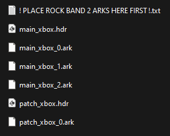
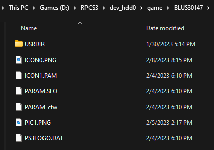
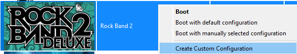
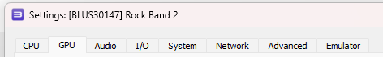

# Rock Band 2 Deluxe

# Introduction

### Rock Band 2 Deluxe is a Massive Quality-of-Life Improvement Mod by [MiloHax](https://github.com/hmxmilohax)

This repo contains everything you need to build Rock Band 2 Deluxe for PlayStation 3 or Xbox 360.

# Table of Contents  
- [Rock Band 2 Deluxe](#rock-band-2-deluxe)
- [Introduction](#introduction)
- [Table of Contents](#table-of-contents)
- [Features](#features)
  - [Quality of Life](#quality-of-life)
  - [Authoring](#authoring)
  - [Additional Modifications](#additional-modifications)
- [Prerequisites](#prerequisites)
- [Setup](#setup)
  - [Pre-Built Versions](#pre-built-versions)
  - [Repo Setup](#repo-setup)
    - [Installing Required Dependencies](#installing-required-dependencies)
    - [Initializing the Repo](#initializing-the-repo)
- [Installing](#installing)
  - [Xenia Emulator](#xenia-emulator)
  - [RPCS3 Emulator](#rpcs3-emulator)
  - [PS3 Hardware](#ps3-hardware)
  - [Xbox 360 Hardware](#xbox-360-hardware)
- [Optional Upgrades](#optional-upgrades)
  - [Songs](#songs)
    - [Installing Songs on Xenia](#installing-songs-on-xenia)
    - [Installing Songs on RPCS3](#installing-songs-on-rpcs3)
    - [Installing Songs on PS3](#installing-songs-on-ps3)
    - [Installing Songs on Xbox 360](#installing-songs-on-xbox-360)
  - [Custom Textures](#custom-textures)
- [Troubleshooting](#troubleshooting)
  - [Repo Troubleshooting](#repo-troubleshooting)
  - [Xenia Troubleshooting](#xenia-troubleshooting)
  - [RPCS3 Troubleshooting](#rpcs3-troubleshooting)
  - [PS3 Troubleshooting](#ps3-rroubleshooting)
  - [Xbox 360 Troubleshooting](#xbox-360-troubleshooting)
- [Dependencies](#dependencies)

# Features

## Quality of Life
* No strum limit executable modification by GMS
* Fast start executable modification by ihatecompvir
* Additional intro skip scripting to skip the intro movie
* [Custom settings loader](https://github.com/hmxmilohax/dx-settings-loader) as a frontend for Xbox and Xenia
* `Overshell` - a custom on-screen menu system for changing modifiers, speeds, textures, and more. Opened by pressing `SELECT, SELECT` on most menu screens
* 1080p support via PS3/RPCS3
* Full Combo indicator per instrument via the multiplier
* New tour setlists utilizing the Rock Band 1 setlist by C0Assassin
* Updated genres from Lego Rock Band/Rock Band 3/Rock Band 4
* Non-Playable characters now playable
* All modifiers unlocked by default
* Integrated Rock Band 1 unexportables
* No losing fans in career on quit/restart
* `Flawless` accomplishment replaced with `Full Combo`, and checks perfect note streak as well as all notes hit
* Double bass pedal port supported on stock rb2/rb3 kits
* Modifier for E-kits to fix an issue the above line introduces (midi drum bass kick fix)
* Disables drum fills by default and replaces activations with auto activations (static fills)
* Modifier to restore Legacy Drum Fills
* Bass streak effect from RB3/RB4 available on all instruments - modifier to restore vanilla functionality
* New menu, `Tweaks`, in game for additional modifications
* Selectable song speed and track speed by 5% increments
* Selectable venue framerate up to 60fps
* Black Venue modifier with decreased load times and system load
* Press select to restart the section in practice mode
* Default difficulty on first load is Expert
* Song title always visible modifier
* Detailed song title modifier including album, year, track number (does not work properly in random/setlists)
* Manual calibration adjusts by 1ms instead of 5ms

## Authoring
* Author shown on song title - in your songs.dta `(author `Author Name`)`
* Autoplay modifier for chart demos
* Gameplay watermarks to deter abuse of autoplay including -
    * Disabling autosave
    * Replacing endgame percentage with `BOT`
    * Manipulating MTV Overlay
* Cycle camera menu button - available in-game when autoplay is enabled

## Additional Modifications
* Selectable colors per fret
* Several modifiers to change the look of the highway/track
* Nice (69%) and Awesome Choke (98-99%) callouts on solo completion
* Various visual upgrades from the fourth main-line Rock Band title
* New main menu music pulled from other Rock Band titles
* Pad is guitar modifier - same functionality as GH1, GH2
* Pad is drum modifier
* Freestyle drums modifier
* Modifier to not force vocal gender per match song
* No flames modifier
* Firework gems modifier
* No crowd modifier
* No whammy effect modifier
* No track muting modifier
* No sustain tails modifier
* Rock Band 3 Sustain look modifier

# Prerequisites

### You will need...

- **A vanilla copy of Rock Band 2** for PS3 or Xbox 360 that you can extract onto your PC. The **USA** version is required for PS3 (`BLUS30147`)
- For Console: A **modded/hacked PS3 or Xbox 360** and a way to transfer files to it, we recommend using FTP
- For Emulator: A **mid-to-high-end PC** capable of running RPCS3 or Xenia

# Setup

*There are a couple different ways you can set up Rock Band 2 Deluxe, you can download a [Pre-Built Version](#pre-built-versions) or [set up the Repo](#repo-setup).*

***Pick which one is best for you.***

## Pre-Built Versions

There are **pre-compiled versions of Rock Band 2 Deluxe** in the [Actions](https://github.com/hmxmilohax/rock-band-2-deluxe/actions) tab of this repo and in the [Nightly link](https://nightly.link/hmxmilohax/rock-band-2-deluxe/workflows/build/main). These are **ready-to-install** files for Rock Band 2 Deluxe for both platforms.

These are **recommended if you have no way of setting up the repo** (unsupported platform, no administrator privileges, etc) or if you **get stuck at any point in [Repo Setup](#repo-setup)**.

These are **not recommended for Xenia** as the repo is structured for you to easily build and run it.

**If you're going to be installing a pre-built version**, skip down to the [Installing](#installing) section. *Mentions of the repo and `build_x.py` can be disregarded, and mentions of `_build` are referring to the contents of the `.zip` file you downloaded from the [Actions](https://github.com/hmxmilohax/rock-band-2-deluxe/actions) tab or [Nightly link](https://nightly.link/hmxmilohax/rock-band-2-deluxe/workflows/build/main).*

  - [Xenia Emulator](#xenia-emulator)
  - [RPCS3 Emulator](#rpcs3-emulator)
  - [PS3 Hardware](#ps3-hardware)
  - [Xbox 360 Hardware](#xbox-360-hardware)

## Repo Setup
Setting up the Rock Band 2 Deluxe repo for the first time is meant to be as easy as possible.
As well, it is designed to allow you to automatically receive updates as the repo is updated.

*If you get stuck here at any point, try using the [Pre-Built Versions](#pre-built-versions) instead.*

### Installing Required Dependencies

***Before you do anything***, you'll need to install a few things before you can properly set up and build Rock Band 2 Deluxe.

[Git for Windows](https://gitforwindows.org/), [Dot Net 6.0 Runtime](https://dotnet.microsoft.com/en-us/download/dotnet/6.0/runtime), and [Python](https://www.python.org/downloads/) (version 3.9 or later).

Install **Git** and **Dot Net 6.0 Runtime** with their default options, and ***select "Add python.exe to PATH"*** on the **Python** installer.

Then, open a **new command prompt** (press `Win+R`, type `cmd` and press Enter), type in `pip install gitpython`, and press enter. Close the command prompt when it's done installing.

### Initializing the Repo

Now, **go to the [Releases](https://github.com/hmxmilohax/rock-band-2-deluxe/releases)** of this repo and **download `_init_repo.bat`** if you're on Windows or **`_init_repo.sh`** if you're on Linux.

Then, make a new **empty** folder, **put `_init_repo` in the folder, and run it**. This will pull the repo down for you and make sure you're completely up to date. **This will take some time.**

### ***The folder should look like this once it's done:***

***The Rock Band 2 Deluxe repo is now set up!*** You are ready to **build and install install** it for your platform of choice:

  - [Xenia Emulator](#xenia-emulator)
  - [RPCS3 Emulator](#rpcs3-emulator)
  - [PS3 Hardware](#ps3-hardware)
  - [Xbox 360 Hardware](#xbox-360-hardware)

**If you were not able to set up the repo properly**, refer to the [Troubleshooting](#repo-troubleshooting) section or use a [Pre-Built Version](#pre-built-versions) instead.

# Installing

*Make sure you follow [Setup](#setup) first!*

## Xenia Emulator

First, **extract your vanilla Rock Band 2 game disc** and copy **ONLY** the *contents* of the `gen` folder to `\_build\xbox\gen\`.

Navigate to `_xenia` and **map your controller with x360ce**. If it asks you to create `xinput1_3.dll`, create it and **rename it to `xinput1_4.dll`**.

Then, navigate to `user_scripts` and **run `build_xenia.py` to automatically update, build, and run Rock Band 2 Deluxe.** You need to run this script every time you want to play. `run_xenia.py`, however, will not automatically build and update the game and will only run it.

***Rock Band 2 Deluxe should now be installed!*** We highly recommend you check out [Optional Upgrades](#optional-upgrades) for songs and other cool stuff you can add to your game.

**If you're having issues**, refer to the [Troubleshooting](#xenia-troubleshooting) section and find your issue.

## RPCS3 Emulator

**NOTE: Rock Band 2 Deluxe only works with USA (`BLUS30147`) copies of the game on PS3.**

First, **extract your vanilla USA (`BLUS30147`) Rock Band 2 game disc** and place it in the `games` folder in your RPCS3 directory. ***Do NOT touch this folder once it's in `games`, Rock Band 2 Deluxe installs as a PS3 game update and installs in its own separate folder, shown below.***

Next, you will need the **latest update for Rock Band 2** installed on RPCS3. [Get it Here](http://b0.ww.np.dl.playstation.net/tppkg/np/BLUS30147/BLUS30147_T1/c8b8d16f692b3672/UP0006-BLUS30147_00-ROCKBAND2PATCH02-A0102-V0100-PE.pkg) and drag and drop it on top of the main RPCS3 window to install it.

*If it doesn't download, right-click it and select `Save link as...` If your browser says it "can't be downloaded safely", ignore it and select `Keep`.*

Then, if you set up the repo, navigate to `user_scripts` and **run `build_ps3.py`**.

After that, **copy the contents** of `\_build\ps3\` to `\dev_hdd0\game\BLUS30147\` in your RPCS3 directory. Click `Yes` to overwrite the files.

***Rock Band 2 Deluxe should now be installed!*** We highly recommend you check out [Optional Upgrades](#optional-upgrades) for songs and other cool stuff you can add to your game.

**If you're having issues**, refer to the [Troubleshooting](#rpcs3-troubleshooting) section and find your issue.

**To update Rock Band 2 Deluxe**, repeat [the above steps](#rpcs3-emulator) (minus installing the vanilla game and the latest update). You can click the `Watch` button (All Activity) to be notified about any updates that occur.

## PS3 Hardware

**NOTE: You WILL need a HACKED/MODDED (CFW or HFW/HEN) PS3 in order to play this mod on console. We hope this is clear.**

**NOTE: Rock Band 2 Deluxe only works with USA (`BLUS30147`) copies of the game on PS3.**

***NOTE: Do NOT touch the contents of your vanilla game if you dumped it to your HDD, Rock Band 2 Deluxe installs as a PS3 game update and installs in its own separate folder, shown below.***

First, you will need the **latest update for Rock Band 2** installed on your system. You can check for updates by inserting your disc, pressing `Triangle`, and selecting `Check for Update`. Update to version `1.02` if it asks you.

Then, if you set up the repo, navigate to `user_scripts` and **run `build_ps3.py`**.

After that, **copy the contents** of `\_build\ps3\` to `\dev_hdd0\game\BLUS30147\`. Click `Yes` to overwrite the files.

***Rock Band 2 Deluxe should now be installed!*** We highly recommend you check out [Optional Upgrades](#optional-upgrades) for songs and other cool stuff you can add to your game.

**If you're having issues**, refer to the [Troubleshooting](#ps3-troubleshooting) section and find your issue.

**To update Rock Band 2 Deluxe**, repeat [the above steps](#ps3-hardware) (minus installing the vanilla game and the latest update). You can click the `Watch` button (All Activity) to be notified about any updates that occur.

## Xbox 360 Hardware

**NOTE: You WILL need a HACKED/MODDED (RGH or JTAG) Xbox 360 in order to play this mod on console. We hope this is clear.**

First, **dump or extract your Rock Band 2 game disc** to a place where Aurora can see it.

Then, if you set up the repo, navigate to `user_scripts` and **run `build_xbox.py`**.

After that, **copy the contents** of `\_build\xbox\` to the location you extracted your disc to. Select `Yes` to overwrite the files.

If you're installing Rock Band 2 Deluxe for the first time, it is recommended that you **rename the vanilla `default.xex` to `default_vanilla.xex`** for safety.

Make sure you **clear your song cache**, as well as your **system cache**.

To clear your **song cache**, navigate to `System Settings > Storage > Rock Band 2` and delete the song cache.

To clear your **system cache**, navigate to `System Settings > Storage` and press `Y` to clear the system cache.

And finally, **disable updates** for Rock Band 2 in Aurora. Rock Band 2 Deluxe rolls `TU6` into its base installation.

***Rock Band 2 Deluxe should now be installed!*** We highly recommend you check out [Optional Upgrades](#optional-upgrades) for songs and other cool stuff you can add to your game.

**If you're having issues**, refer to the [Troubleshooting](#xbox-360-troubleshooting) section and find your issue.

**To update Rock Band 2 Deluxe**, repeat [the above steps](#xbox-360-hardware) (minus installing the vanilla game). You can click the `Watch` button (All Activity) to be notified about any updates that occur.

# Optional Upgrades

*These are some optional, but very handy additions you can make to your Rock Band 2 Deluxe installation.*

## Songs

You can find song packs compatible with all Rock Band titles for both platforms on this [Spreadsheet](https://docs.google.com/spreadsheets/d/1-3lo2ASxM-3yVr_JH14F7-Lc1v2_FcS5Rv_yDCANEmk/edit#gid=0).

You can also use [Onyx Music Game Toolkit](https://github.com/mtolly/onyxite-customs) to generate your own custom song packs for Rock Band games or convert Xbox 360 packs to PS3, and vice versa. Converting custom songs from games like Clone Hero is a breeze.

### Installing Songs on Xenia

Download an Xbox 360 song pack of your choice and open Xenia. Navigate to `File > Install Content`, and select your song pack(s) of choice. You can select more than one at a time. Xenia supports both CON and LIVE files.

### Installing Songs on RPCS3

Download a PS3 song pack of your choice and open RPCS3. Drag and drop the song pack you want to install on top of the main RPCS3 window and select `Yes` to install it.

### Installing Songs on PS3

Download a PS3 song pack of your choice and put it on the root of a USB drive. Then, open `Package Manager` and select the song pack you want to install.

### Installing Songs on Xbox 360

Download an Xbox 360 song pack of your choice, then copy it to its respective folder.

***For RB2 LIVE files, install them to:***

## Custom Textures

Rock Band 2 Deluxe has a variety of custom textures, found in the `Deluxe Settings` menu in-game, as well as a way to import your own with relative ease.

### Importing Your Own Textures

**For highways**, copy any `.jpg`, `.png`, or `.bmp` file into `\custom_textures\highways\`, then navigate back to `user_scripts` and run `process_textures_highway.py`. **The process is the same for other texture types**, just insert them to their according folder and run the according script.

These will resize your images accordingly, including those with arbitrary resolutions, and convert them to the proper format for Rock Band 2 Deluxe to read.

***You will need to rebuild Rock Band 2 Deluxe in order for these to take effect.***

# Troubleshooting

*If you're having issues with Rock Band 2 Deluxe, here's where you can look for common issues and try to solve yours.*

***Below every issue are most of the possible reasons they may be happening and how you can fix them.***

## Repo Troubleshooting

### ***The `.bat`/`.py` files open and immediately close!***
* You don't have all the required dependencies installed.
    * Head back to [Installing Required Dependencies](#installing-required-dependencies) and make sure you followed the directions properly.

## Xenia Troubleshooting

### ***My game opens to a black screen!***
* You don't have a vanilla copy of Rock Band 2 installed.
    * Extract your disc and extract **ONLY** the *contents* of the `gen` folder to `\_build\xbox\gen\`. That folder should look like this after Rock Band 2 Deluxe is built:

* Rock Band 2 Deluxe did not build properly.
    * Make sure you have [Dot Net 6.0 Runtime](https://dotnet.microsoft.com/en-us/download/dotnet/6.0/runtime) installed.

### ***The game doesn't get past the splash screens!***
* You are not supposed to replace `default.xex` in `\_build\xbox\`, only the contents of the `gen` folder.
    * Navigate to `user_scripts` and run `git_reset.py` to rebase your repo.

### ***My controller isn't working even though I have x360ce set up!***
* Navigate to `_xenia` and rename `xinput1_3.dll` to `xinput1_4.dll`.

### ***The framerate is awful (below 60)!***
* Your PC is most likely not capable of running Xenia and we haven't found any settings to help optimize it.
    * You can try using [RPCS3](#rpcs3-emulator) instead, but you may get similar results.

### ***The character models don't look correct!***
* Navigate to `_xenia`, open `xenia-canary.config.toml` in your text editor of choice, and change `gpu` from `vulkan` to `d3d12` and `d3d12_readback_resolve` from `false` to `true` (you may need to press `CTRL + F` to find these). This will fix all texture issues but will drastically affect the framerate, you also may experience BSODs. If you don't want to deal with any of this, we recommend using [RPCS3](#rpcs3-emulator) instead.

## RPCS3 Troubleshooting

### ***I can't find `BLUS30147` in `\dev_hdd0\game\`!***
* You do not have the latest update for Rock Band 2 installed in RPCS3.
    * [Get it Here](http://b0.ww.np.dl.playstation.net/tppkg/np/BLUS30147/BLUS30147_T1/c8b8d16f692b3672/UP0006-BLUS30147_00-ROCKBAND2PATCH02-A0102-V0100-PE.pkg) and drag and drop it on top of the main RPCS3 window to install it.
       * *If it doesn't download, right-click it and select `Save link as...` If your browser says it "can't be downloaded safely", ignore it and select `Keep`.*

### ***Rock Band 2 no longer shows up in the game list!***
* You are not supposed to touch any of the files where your vanilla game disc is installed.
    * Re-extract your disc and install Rock Band 2 Deluxe to `\dev_hdd0\game\BLUS30147\`.
        * If it's installed correctly, it will look like this:

### ***Rock Band 2 Deluxe did not install at all!***
* Make sure your copy of Rock Band 2 is the **USA version (`BLUS30147`)**.

### ***I'm getting a disc read error!***
* Make sure you copy the **ENTIRE** contents of `\_build\ps3\` to `\dev_hdd0\game\BLUS30147\` (including EBOOT.BIN).

### ***The framerate is awful!***
* Your PC is most likely not capable of running RPCS3, but you can try messing with the config and seeing what works best for you.

### ***The character models don't look correct!***
* Right-click Rock Band 2 in your RPCS3 games list and create a custom configuration. Then, go to the `GPU` tab and enable `Write Color Buffers`. This will not affect the framerate nearly as much as it does on Xenia.

## PS3 Troubleshooting

### ***I don't see `BLUS30147` in `\dev_hdd0\game\`!***
* You do not have the latest update for Rock Band 2 installed on your system.
    * You can check for updates by inserting your disc, pressing `Triangle`, and selecting `Check for Update`. Update to version `1.02` if it asks you.

### ***The game shows up as "Unsupported Data"!***
* You are not supposed to touch any of the files where your vanilla game disc is installed.
    * Re-dump your disc and install Rock Band 2 Deluxe to `\dev_hdd0\game\BLUS30147\`. If it's installed correctly, it will look like this:

### ***I'm getting a disc read error!***
* Make sure you copy the **ENTIRE** contents of `\_build\ps3\` to `\dev_hdd0\game\BLUS30147\` (including EBOOT.BIN).
* If you're loading your base copy of Rock Band 2 from the disc itself, actually check the disc.

## Xbox 360 Troubleshooting

### ***The game doesn't get past the splash screens!***
* Make sure you copy the **ENTIRE** contents of `\_build\xbox\` to where your vanilla copy of Rock Band 2 lives.

# Dependencies

[Git for Windows](https://gitforwindows.org/) - CLI application to allow auto updating Deluxe repo files

[Dot Net 6.0 Runtime](https://dotnet.microsoft.com/en-us/download/dotnet/6.0/runtime) - Needed to run ArkHelper

[Python](https://www.python.org/downloads/) - For user script functionality (NOTE: 3.9 or newer is highly recommended!)

[Mackiloha](https://github.com/PikminGuts92/Mackiloha) - ArkHelper for building Deluxe - SuperFreq for building .bmp_xbox highway images

[swap_rb_art_bytes.py](https://github.com/PikminGuts92/re-notes/blob/master/scripts/swap_rb_art_bytes.py) - Python script for converting Xbox images to PS3

[dtab](https://github.com/mtolly/dtab) - For serializing `.dtb` script files
